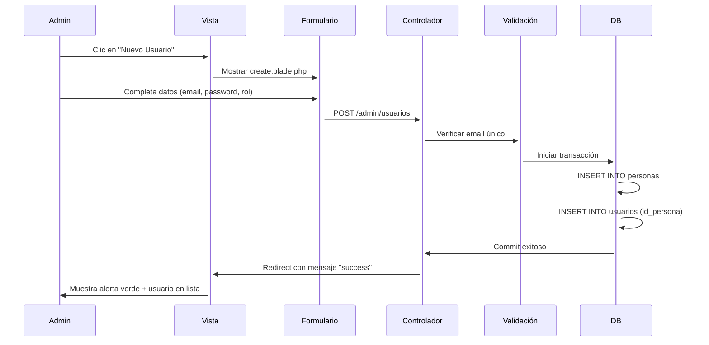

# 📘 Guía Técnica del Módulo de Administración - NutriChef

**Panel Administrativo para la Gestión Integral de la Plataforma**

[](https://laravel.com)
[](https://tailwindcss.com)
[](LICENSE)

---

## 📋 Tabla de Contenidos

- [Descripción General](#-descripción-general)
- [Arquitectura del Sistema](#-arquitectura-del-sistema)
- [Estructura de Archivos](#-estructura-de-archivos)
- [Módulos Implementados](#-módulos-implementados)
- [Flujos de Operación](#-flujos-de-operación)
- [Guía de Estilos UI/UX](#-guía-de-estilos-uiux)
- [Instalación y Configuración](#-instalación-y-configuración)
- [Contribución](#-contribución)

---

## 🎯 Descripción General

El **Panel de Administración de NutriChef** es un sistema web completo para la gestión de recetas saludables, usuarios y contenido de la plataforma. Construido con Laravel 11 siguiendo las mejores prácticas del framework, proporciona una interfaz intuitiva para administradores que permite moderar contenido, gestionar usuarios y monitorear la actividad del sistema en tiempo real.

**Acceso:** `http://localhost:18000/admin`

### Características Principales

✅ Gestión completa de recetas con sistema de moderación  
✅ Administración de usuarios con control de roles y permisos  
✅ Dashboard interactivo con métricas en tiempo real  
✅ Sistema de filtrado y búsqueda avanzada  
✅ Interfaz responsive construida con Tailwind CSS  
✅ Componentes reutilizables y modales de confirmación  

---

## 🏗️ Arquitectura del Sistema

El proyecto implementa el patrón **MVC (Modelo-Vista-Controlador)** de Laravel con una separación estricta de responsabilidades:

```
┌─────────────────────────────────────────────────────┐
│                    NAVEGADOR                        │
│              (Usuario Administrador)                │
└─────────────────┬───────────────────────────────────┘
                  │
                  ▼
         ┌────────────────────┐
         │   RUTAS (Router)   │ ← routes/web.php
         │  Middleware: Auth  │
         └─────────┬──────────┘
                   │
                   ▼
      ┌────────────────────────────┐
      │     CONTROLADORES          │ ← app/Http/Controllers/Admin/
      │  • RecetaController        │
      │  • UsuarioController       │
      │  • DashboardController     │
      └────────┬──────────┬────────┘
               │          │
       ┌───────▼──┐   ┌───▼──────┐
       │ MODELOS  │   │  VISTAS  │
       │ Eloquent │   │  Blade   │
       └────┬─────┘   └──────────┘
            │
            ▼
    ┌───────────────┐
    │ BASE DE DATOS │
    │  PostgreSQL   │
    └───────────────┘
```

### Componentes Clave

| Componente | Ubicación | Responsabilidad |
|------------|-----------|-----------------|
| **Modelos** | `app/Models/` | Estructura de datos y relaciones Eloquent |
| **Controladores** | `app/Http/Controllers/Admin/` | Lógica de negocio y validaciones |
| **Vistas** | `resources/views/admin/` | Interfaz de usuario (Blade + Tailwind) |
| **Rutas** | `routes/web.php` | Mapeo de URLs a controladores |

---

## 📁 Estructura de Archivos

### Rutas Principales (`routes/web.php`)

```php
// Autenticación
Route::get('/login', [LoginController::class, 'login']);
Route::post('/logout', [LoginController::class, 'logout']);

// Panel Administrativo (protegido por middleware)
Route::prefix('admin')->middleware('auth')->group(function () {
    Route::get('/dashboard', [DashboardController::class, 'index']);
    Route::resource('recetas', RecetaController::class);
    Route::resource('usuarios', UsuarioController::class);
    Route::post('recetas/{id}/approve', [RecetaController::class, 'approve']);
});
```

### Controladores Clave

#### 📄 `RecetaController.php`

Gestiona el ciclo de vida completo de las recetas.

```php
class RecetaController extends Controller
{
    // Lista recetas con filtros y paginación
    public function index(Request $request)
    {
        $recetas = Receta::with(['creador', 'estado'])
            ->when($request->estado, fn($q) => $q->where('id_estado', $request->estado))
            ->paginate(15);
        
        return view('admin.recetas.index', compact('recetas'));
    }
    
    // Muestra detalle para moderación
    public function show($id)
    {
        $receta = Receta::with(['ingredientes', 'multimedia'])->findOrFail($id);
        return view('admin.recetas.show', compact('receta'));
    }
    
    // Elimina una receta
    public function destroy($id)
    {
        Receta::findOrFail($id)->delete();
        return redirect()->back()->with('success', 'Receta eliminada correctamente');
    }
    
    // Aprueba una receta (cambia estado a PUBLICADA)
    public function approve($id)
    {
        $receta = Receta::findOrFail($id);
        $receta->update(['id_estado' => Estado::PUBLICADA]);
        return redirect()->back()->with('success', 'Receta aprobada');
    }
}
```

#### 📄 `UsuarioController.php`

CRUD completo con gestión de roles y bloqueos.

**Características:**
- Creación de usuarios con roles específicos (Admin, Chef, Usuario)
- Edición de perfiles usando transacciones de base de datos
- Sistema de bloqueo/activación (Soft Ban)
- Validación de emails únicos

#### 📄 `DashboardController.php`

Centro de control con métricas en tiempo real.

```php
public function index()
{
    $stats = [
        'total_usuarios' => Usuario::count(),
        'recetas_pendientes' => Receta::where('id_estado', Estado::PENDIENTE)->count(),
        'recetas_publicadas' => Receta::where('id_estado', Estado::PUBLICADA)->count(),
        'actividad_reciente' => ActividadLog::latest()->take(10)->get()
    ];
    
    return view('admin.dashboard', compact('stats'));
}
```

### Modelos y Relaciones

```php
// app/Models/Usuario.php
class Usuario extends Authenticatable
{
    public function rol() {
        return $this->belongsTo(Rol::class, 'id_rol');
    }
    
    public function persona() {
        return $this->hasOne(Persona::class, 'id_persona');
    }
    
    public function recetas() {
        return $this->hasMany(Receta::class, 'id_creador');
    }
}

// app/Models/Receta.php
class Receta extends Model
{
    public function creador() {
        return $this->belongsTo(Usuario::class, 'id_creador');
    }
    
    public function estado() {
        return $this->belongsTo(Subdominio::class, 'id_estado');
    }
    
    public function multimedia() {
        return $this->hasMany(Multimedia::class, 'id_receta');
    }
}
```

### Vistas Blade

```
resources/views/
├── layouts/
│   └── admin.blade.php          # Plantilla maestra (Sidebar + Navbar)
├── admin/
│   ├── dashboard.blade.php      # Panel principal con KPIs
│   ├── recetas/
│   │   ├── index.blade.php      # Tabla de recetas con filtros
│   │   ├── show.blade.php       # Detalle para moderación
│   │   └── create.blade.php     # Formulario de creación
│   └── usuarios/
│       ├── index.blade.php      # Directorio de usuarios
│       ├── create.blade.php     # Alta de usuarios
│       └── edit.blade.php       # Edición de perfil
└── components/
    ├── modal-confirm.blade.php  # Modal de confirmación reutilizable
    └── alert.blade.php          # Alertas de éxito/error
```

---

## 🧩 Módulos Implementados

### 1. 📝 Gestión de Recetas

Permite moderar todo el contenido generado por los usuarios.

**Funcionalidades:**
- ✅ Listado con filtros por estado (Pendiente, Aprobada, Rechazada)
- ✅ Búsqueda en tiempo real por título o ingredientes
- ✅ Vista de detalle con información nutricional completa
- ✅ Moderación rápida con botones de Aprobar/Rechazar
- ✅ Edición directa sin contactar al autor
- ✅ Eliminación con confirmación modal

**Flujo de Moderación:**
```
Receta Creada (Usuario) → PENDIENTE → Revisión (Admin) → APROBADA/RECHAZADA
```

### 2. 👥 Gestión de Usuarios

Control total sobre cuentas y permisos.

**Funcionalidades:**
- ✅ Creación de administradores y chefs desde el panel
- ✅ Edición de roles (promoción/degradación)
- ✅ Sistema de bloqueo inmediato (toggle activo/inactivo)
- ✅ Visualización de actividad reciente por usuario
- ✅ Gestión separada de datos de cuenta y personales

**Roles Disponibles:**
- 🔴 **Admin:** Acceso completo al panel
- 🟡 **Chef:** Puede crear recetas sin moderación
- 🟢 **Usuario:** Acceso básico (requiere aprobación de recetas)

### 3. 📊 Dashboard Interactivo

Centro de mando con indicadores clave de rendimiento.

**Métricas en Tiempo Real:**
- Total de usuarios registrados
- Recetas pendientes de moderación (alerta visual si > 10)
- Recetas publicadas hoy
- Últimas 10 acciones del sistema

**Widgets:**
- Gráfico de recetas por categoría
- Usuarios más activos de la semana
- Acceso directo a tareas pendientes

---

## 🔄 Flujos de Operación

### Flujo: Eliminar una Receta

```
┌──────────────┐
│ 1. Usuario   │ Hace clic en botón "Eliminar" (icono basurero)
│   (Admin)    │
└───────┬──────┘
        │
        ▼
┌──────────────────┐
│ 2. JavaScript    │ openModal() muestra confirmación
│    (Frontend)    │ Actualiza acción del formulario: /admin/recetas/{id}
└───────┬──────────┘
        │
        ▼
┌──────────────────┐
│ 3. Usuario       │ Confirma "Sí, eliminar"
│   Confirma       │
└───────┬──────────┘
        │
        ▼
┌──────────────────┐
│ 4. Navegador     │ POST /admin/recetas/{id} con _method=DELETE
└───────┬──────────┘
        │
        ▼
┌──────────────────┐
│ 5. Router        │ Route::delete('/admin/recetas/{id}')
│   (Laravel)      │ → RecetaController@destroy
└───────┬──────────┘
        │
        ▼
┌──────────────────┐
│ 6. Controlador   │ Receta::findOrFail($id)->delete()
│                  │ return redirect()->with('success', '...')
└───────┬──────────┘
        │
        ▼
┌──────────────────┐
│ 7. Vista         │ Recarga página
│   (Blade)        │ Muestra alerta verde de éxito
│                  │ La receta ya no aparece en la tabla
└──────────────────┘
```

### Flujo: Crear Usuario



---

## 🎨 Guía de Estilos UI/UX

### Paleta de Colores (Tailwind CSS)

| Color | Clase Tailwind | Hexadecimal | Uso Principal |
|-------|----------------|-------------|---------------|
| 🟠 **Naranja Calabaza** | `bg-calabaza-600` | `#EA580C` | Botones primarios, enlaces activos |
| 🟡 **Dorado Ámbar** | `bg-ambar-800` | `#92400E` | Sidebar, identidad institucional |
| 🟢 **Verde Esmeralda** | `text-emerald-600` | `#059669` | Estados positivos, éxito |
| 🔴 **Rojo** | `text-red-600` | `#DC2626` | Acciones destructivas, rechazos |
| ⚫ **Gris Pizarra** | `text-slate-500` | `#64748B` | Textos secundarios, bordes |

### Componentes Reutilizables

#### Modal de Confirmación

```blade
<!-- resources/views/components/modal-confirm.blade.php -->
<div id="confirmModal" class="hidden fixed inset-0 bg-black bg-opacity-50 z-50">
    <div class="bg-white rounded-lg p-6 max-w-md mx-auto mt-20">
        <h3 class="text-lg font-bold text-gray-900">¿Estás seguro?</h3>
        <p class="text-gray-600 mt-2">Esta acción no se puede deshacer.</p>
        
        <form id="confirmForm" method="POST">
            @csrf
            @method('DELETE')
            <div class="flex gap-3 mt-6">
                <button type="submit" class="bg-red-600 text-white px-4 py-2 rounded">
                    Sí, eliminar
                </button>
                <button type="button" onclick="closeModal()" class="bg-gray-200 px-4 py-2 rounded">
                    Cancelar
                </button>
            </div>
        </form>
    </div>
</div>
```

#### Sistema de Alertas

```blade
@if (session('success'))
    <div class="bg-emerald-100 border-l-4 border-emerald-600 text-emerald-900 p-4 mb-4">
        <p class="font-bold">✓ Éxito</p>
        <p>{{ session('success') }}</p>
    </div>
@endif
```

### Iconografía (Lucide Icons)

```html
<!-- Importar en layouts/admin.blade.php -->
<script src="https://unpkg.com/lucide@latest"></script>
<script>lucide.createIcons();</script>

<!-- Uso en vistas -->
<i data-lucide="trash-2"></i>  <!-- Eliminar -->
<i data-lucide="check"></i>     <!-- Aprobar -->
<i data-lucide="x"></i>         <!-- Rechazar -->
<i data-lucide="edit"></i>      <!-- Editar -->
```

---

## 🚀 Instalación y Configuración

### Requisitos Previos

- PHP 8.2+
- Composer 2.x
- PostgreSQL 14+
- Node.js 18+ (para compilar assets)

### Pasos de Instalación

```bash
# 1. Clonar repositorio
git clone https://github.com/tu-org/nutrichef-admin.git
cd nutrichef-admin

# 2. Instalar dependencias PHP
composer install

# 3. Instalar dependencias Node
npm install

# 4. Configurar variables de entorno
cp .env.example .env
php artisan key:generate

# 5. Configurar base de datos en .env
DB_CONNECTION=pgsql
DB_HOST=127.0.0.1
DB_PORT=5432
DB_DATABASE=nutrichef
DB_USERNAME=tu_usuario
DB_PASSWORD=tu_password

# 6. Ejecutar migraciones
php artisan migrate --seed

# 7. Compilar assets (Tailwind CSS)
npm run build

# 8. Iniciar servidor de desarrollo
php artisan serve --port=18000
```

### Acceso por Defecto

**URL:** `http://localhost:18000/admin`  
**Usuario:** `admin@nutrichef.com`  
**Contraseña:** `admin123`

---

## 🤝 Contribución

### Guía de Desarrollo

1. **Branches:**
   - `main`: Producción estable
   - `develop`: Desarrollo activo
   - `feature/*`: Nuevas funcionalidades
   - `fix/*`: Correcciones de bugs

2. **Commits:**
   ```
   feat: Agregar filtro avanzado en recetas
   fix: Corregir error en paginación de usuarios
   docs: Actualizar README con flujo de moderación
   ```

3. **Testing:**
   ```bash
   php artisan test
   php artisan test --filter RecetaControllerTest
   ```

### Equipo "Con Pila" 🔋

- **Elbey** - Líder Técnico & Backend Developer
- [Tu equipo aquí]

---

## 📄 Licencia

Este proyecto es parte del curso **Software Engineering I** de la Escuela Militar de Ingeniería (EMI), Bolivia.

**Última actualización:** Noviembre 2025

---

## 📞 Soporte

¿Tienes preguntas o encontraste un bug?

- 📧 Email: elbey@nutrichef.edu.bo
- 📚 Documentación: [Wiki del Proyecto](https://github.com/tu-org/nutrichef/wiki)
- 🐛 Reportar Bug: [Issues](https://github.com/tu-org/nutrichef/issues)

---

**Hecho con ❤️ por el equipo Con Pila 🔋**